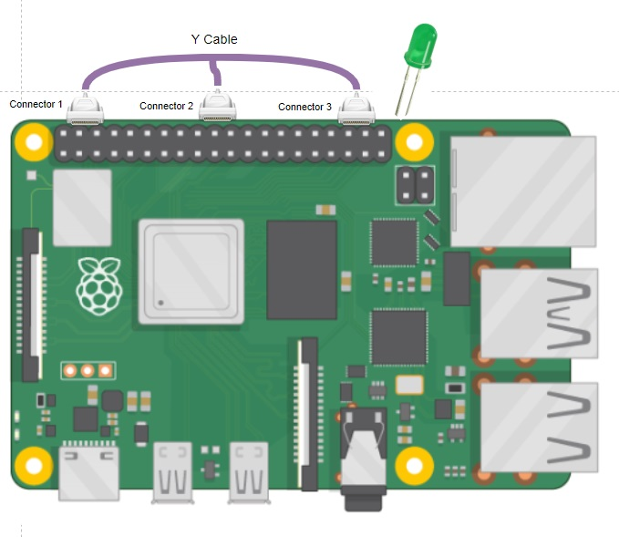
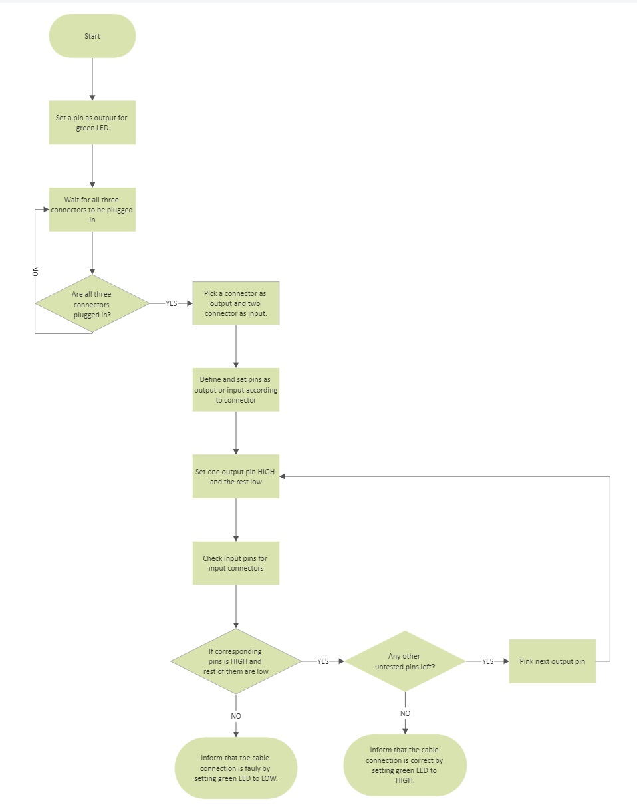

# RPI Cable Tester

This project aims to detect the correct pinning of a cable harness using a Raspberry Pi and indicate the correct connection via an externally connected LED. The project will be based on the Raspberry Pi 4 model.



## Algorithm

1. Set up the GPIO pins that will be used to connect to the cable harness and the LED.
2. Set the GPIO pins as inputs and outputs, respectively.
3. Continuously read the input values from the GPIO pins connected to the cable harness.
4. If the input values match the correct pinning configuration, set the GPIO pin connected to the LED to high and turn on the 
green LED.
5. If the input values do not match the correct pinning configuration, set the GPIO pin connected to the LED to low and turn off the green LED.



## Implementation
The code will be written in Python and will be designed to run at startup on the Raspberry Pi. Here are the steps for implementing the code:

1. Set up the GPIO pins using the RPi.GPIO library in Python.
2. Create a function to read the input values from the GPIO pins connected to the cable harness.
3. Create a function to set the GPIO pin connected to the LED to high or low, depending on whether the input values match the correct pinning configuration.
4. Continuously run the code in a loop to read the input values and set the LED status accordingly.
5. Create a systemd service to start the script on boot.

## Hardware Information
The cable harness will consist of three connectors, each connected to six pins of the RPi GPIO header. The exact pins to be used can be chosen based on availability. The LED will be connected to a GPIO pin and will turn on when the correct pinning configuration is detected. The voltage and current requirements of the LED will be taken care of by using appropriate resistors in the circuit.

## Installation

Clone the repository using git clone https://github.com/AbdullahAydn/RPI_Cable_Tester.git

Sure, here's a step-by-step guide to creating a systemd service that runs your cable testing script on startup:

1. Open a terminal window on your Raspberry Pi.
2. Create a new file for the service configuration using the nano text editor:
```bash
sudo nano /etc/systemd/system/cable-test.service
```
This command will open a new file called cable-test.service in the /etc/systemd/system/ directory using nano.

3. Add the following code to the file:
```bash
[Unit]
Description=Cable Testing Service
After=network.target

[Service]
ExecStart=/usr/bin/python3 /path/to/cable-testing-script.py
WorkingDirectory=/path/to/script/directory
StandardOutput=inherit
StandardError=inherit
Restart=always
User=pi

[Install]
WantedBy=multi-user.targett
```
Replace /path/to/cable-testing-script.py with the full path to the Python script that you created in the previous task. Replace /path/to/script/directory with the full path to the directory that contains the script file.

4. Save and close the file by pressing Ctrl+X, then Y, then Enter.
5. Reload the systemd daemon to pick up the new service configuration:
```bash
sudo systemctl daemon-reload
```
6. Enable the service to start automatically on boot:
```bash
sudo systemctl enable cable-test.service
```
7. Reboot your Raspberry Pi to test the service:
```bash
sudo reboot
```
The cable testing script should start automatically when your Raspberry Pi boots up. You can check the status of the service using the following command:

```bash
sudo systemctl status cable-test.service
``` 
This will show the status of the service, including any error messages that may have occurred.

## Contributing

Pull requests are welcome. For major changes, please open an issue first
to discuss what you would like to change.

Please make sure to update tests as appropriate.

## License

[Apache](http://www.apache.org/licenses/)
